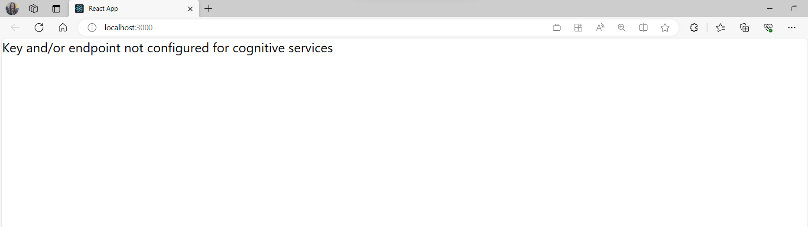
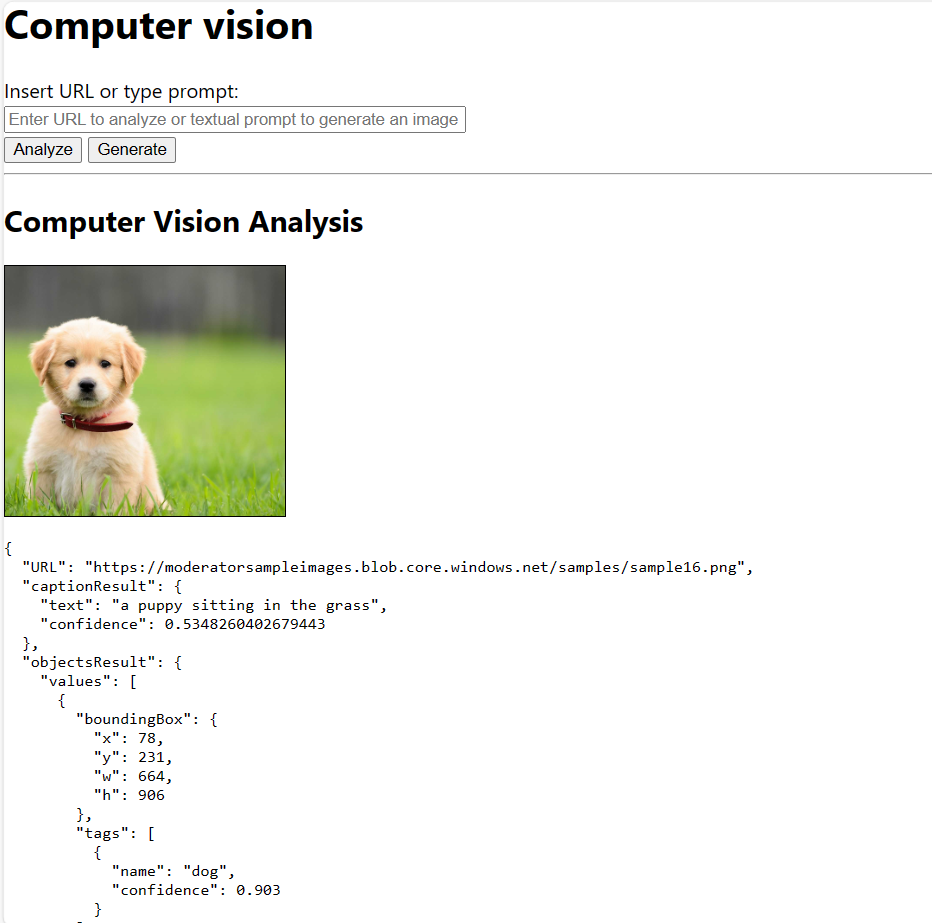
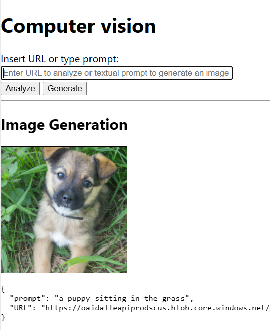

# Analyze and generate images with Cognitive Services
This repository contains the demo material for the Microsoft Reactor session *"The CEMA AI Show - Cognitive Services"*.

### Empower your app with Computer Vision
Do you know how AI can see the world around us? Do you know how AI can generate a picture of a seaside landscape in a photorealistic style? In this session, we are going to demystify computer vision and image generation to show you how you can embed them into your applications using Azure services.


* Speakers: [Carlotta Castelluccio](https://www.linkedin.com/in/carlotta-castelluccio/), Cloud Advocate at Microsoft &
            [Hadeel Shubair](https://www.linkedin.com/in/hadeel-shubair-9883a9160/), Cloud Advocate at Microsoft
* Event page: [The AI show! Session #5 - Cognitive Services](https://developer.microsoft.com/en-us/reactor/events/19883/?WT.mc_id=academic-99204-cacaste) 

## Pre-requisites

### To run the app locally
To set up your local environment and run the web app you need to configure the following pre-requisites:
* [Azure subscription](https://azure.microsoft.com/en-us/pricing/offers/ms-azr-0044p/) or an [Azure for students free trial](https://azure.microsoft.com/en-us/students/?WT.mc_id=academic-99204-cacaste).
  * [Computer vision resource](https://ms.portal.azure.com/#create/Microsoft.CognitiveServicesComputerVision).
  * [Azure OpenAI resource](https://ms.portal.azure.com/#create/Microsoft.CognitiveServicesOpenAI). Access to this service (and in particular to DALLE model) should be requested in advance through [this form](https://customervoice.microsoft.com/Pages/ResponsePage.aspx?id=v4j5cvGGr0GRqy180BHbR7en2Ais5pxKtso_Pz4b1_xUOFA5Qk1UWDRBMjg0WFhPMkIzTzhKQ1dWNyQlQCN0PWcu). If your application don't match the [acceptance criteria](https://learn.microsoft.com/legal/cognitive-services/openai/limited-access?context=%2Fazure%2Fcognitive-services%2Fopenai%2Fcontext%2Fcontext?WT.mc_id=academic-99204-cacaste), you can use [OpenAI public APIs](https://platform.openai.com/docs/api-reference/introduction).
* [Node.js and npm](https://nodejs.org/en/download) - installed to your local machine.
* [Visual Studio Code](https://code.visualstudio.com/) - installed to your local machine.

### To deploy the app on the Cloud
In addition to the pre-requisites above, if you wish to deploy and run your app on Azure you'll need to have the following:
* [Azure static Web App resource](https://ms.portal.azure.com/#create/Microsoft.StaticApp).
* [Azure Static Web Apps VS Code extension](https://marketplace.visualstudio.com/items?itemName=ms-azuretools.vscode-azurestaticwebapps) - used to deploy React app to Azure Static Web app.
* [GitHub account](https://github.com/) - to fork and push to a repo, which activates [GitHub actions](https://docs.github.com/actions).

## Description
The goal of this demo is to showcase how to empower your app with Computer Vision capabilities. 

### App functionalities
The React app of this demo provides the following functionalities:

* Displays message if Azure key and endpoint for Cognitive Services Computer Vision or Azure OpenAI service isn't found.


* Allows you to analyze an image with Cognitive Services Computer Vision, by entering a public image URL or analyzing an image from collection.
  * When analysis is complete: it displays the analyzed image and Computer Vision JSON results.

  

* Allows you to generate an image with [DALLE](https://openai.com/dall-e-2), by entering a textual prompt. 
  * When generation process is complete: it displays the generated image and the corresponding url.
  
  

### Step-by-step guide

### To run the app locally
1. Fork this repository and clone it on your machine.
2. Install all the required dependencies by running `npm install` in a terminal or bash window, from the project folder.
3. [Get your Computer Vision credentials](https://learn.microsoft.com/azure/cognitive-services/cognitive-services-apis-create-account?tabs=multiservice%2Canomaly-detector%2Clanguage-service%2Ccomputer-vision%2Clinux#get-the-keys-for-your-resource&?WT.mc_id=academic-99204-cacaste) and add them as environment variables in a terminal  (use `export` rather than `set` if you are in a bash window).
  * set REACT_APP_AZURE_COMPUTER_VISION_KEY="REPLACE-WITH-YOUR-KEY"
  * set REACT_APP_AZURE_COMPUTER_VISION_ENDPOINT="REPLACE-WITH-YOUR-ENDPOINT"
4. Get your OpenAI instance credentials and add them as environment variables in a terminal (use `export` rather than `set` if you are in a bash window).
  * set REACT_APP_AZURE_OPENAI_KEY="REPLACE-WITH-YOUR-KEY"
  * set REACT_APP_AZURE_OPENAI_ENDPOINT="REPLACE-WITH-YOUR-ENDPOINT"
  
  If you are using an **Azure OpenAI endpoint**, you can retrieve your credentials from the *Keys and Endpoint* tab of your resource in the Azure Portal. On the other hand, if you are using an **OpenAI instance**, you can retrieve your key from [your user page](https://platform.openai.com/account/api-keys), while your endpoint is *https://api.openai.com/v1/*.

  ### To deploy the app on the Cloud
  1. Add environment variables to your remote environment, to enable GitHub actions to pass the secrets to the Static Web App. 
  In a web browser, on your GitHub repository, select *Settings* -> *Secrets and variables* -> *Actions* -> *New repository secrets*. Enter the same name and value for the keys and endpoints you used in the previous section.

  2. In Visual Studio Code, open the project folder and select the *Azure* icon in the left-hand side menu. Select *Static Web Apps* -> *Create New Static Web App*. Select the GitHub repository you forked and the branch you want to deploy. Select *React* as the build preset. 

  3. Pull down the changes made from creating the Azure resource to get the GitHub Action file. In the Visual Studio Code editor, edit the GitHub Action file found at *./.github/workflows/* to add the secrets (under the *build_and_deploy_job*).

  ```
  env:
    REACT_APP_AZURE_COMPUTER_VISION_ENDPOINT: ${{secrets.REACT_APP_AZURE_COMPUTER_VISION_ENDPOINT}}
    REACT_APP_AZURE_COMPUTER_VISION_KEY:  ${{secrets.REACT_APP_AZURE_COMPUTER_VISION_KEY}}
    REACT_APP_AZURE_OPENAI_ENDPOINT: ${{secrets.REACT_APP_AZURE_OPENAI_ENDPOINT}}
    REACT_APP_AZURE_OPENAI_KEY:  ${{secrets.REACT_APP_AZURE_OPENAI_KEY}} 

  ```

  4. Add and commit the change to the local main branch. Push the change to the remote repository, starting a new build-and-deploy action to your Azure Static web app.

  5. Monitor the build-and-deploy action in the *Actions* tab of your GitHub repository. Once the action is complete, you can view your deployed app by selecting the *Browse to URL* link in the *Azure Static Web Apps* section of the action.

  ### Switching from an Azure OpenAI endpoint to OpenAI endpoint and viceversa
  Azure OpenAI service api and OpenAI api handles the construction of the endpoint and of the authentication header differently. 
  If you want to switch from one to the other, you need to change the code in *./src/azure-cognitiveservice-openai.js*. Look for the comments *"Uncomment this line to use (...)"*, uncomment the code for the service you want to use and comment the code for the other service.

  Not sure what's the difference between the two services? Learn more [here](https://learn.microsoft.com/en-gb/azure/cognitive-services/openai/overview#comparing-azure-openai-and-openai/?WT.mc_id=academic-99204-cacaste).

## Useful Resources
* [Create Computer Vision solutions with Azure Cognitive Services](https://learn.microsoft.com/en-us/training/paths/create-computer-vision-solutions-azure-cognitive-services/?WT.mc_id=academic-99204-cacaste)
* [What is Image Analysis?](https://learn.microsoft.com/en-us/azure/cognitive-services/computer-vision/overview-image-analysis?tabs=4-0&WT.mc_id=academic-99204-cacaste)
* [Generating an image using Azure OpenAI service](https://learn.microsoft.com/en-us/azure/cognitive-services/openai/dall-e-quickstart?pivots=rest-api&WT.mc_id=academic-99204-cacaste)
* [Build and deploy a Static Web app to Azure](https://learn.microsoft.com/en-us/azure/developer/javascript/tutorial/static-web-app-image-analysis?tabs=bash%2Cvscode&WT.mc_id=academic-99204-cacaste)

